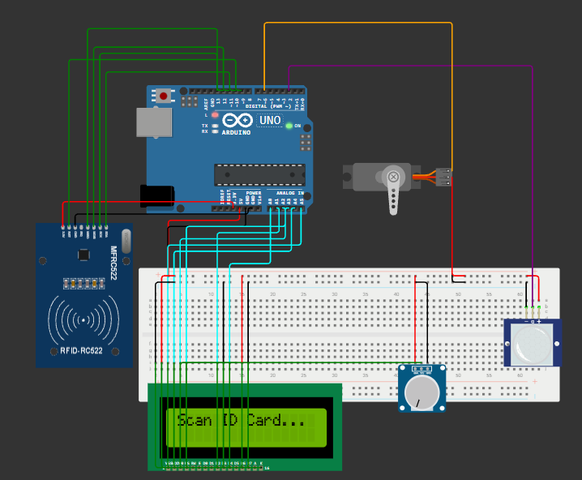
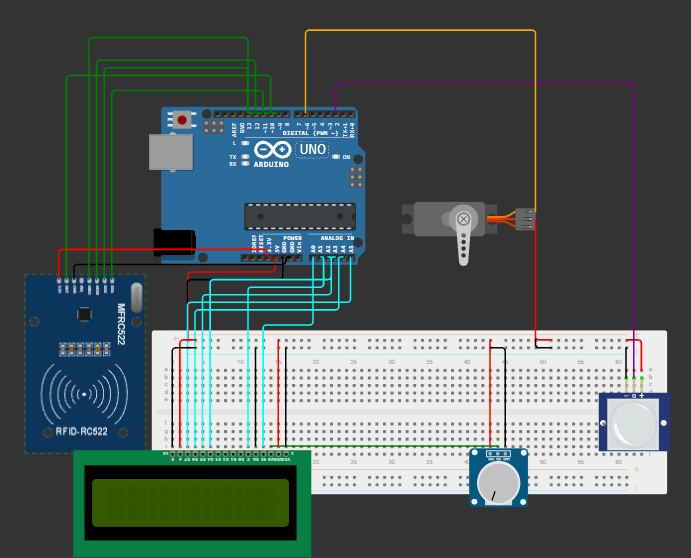

# Secure Edge-Node Access Control System

**Author:** Jeremie J. Rubio
**Role:** Electrical Engineering Undergraduate, University of California, Riverside

## Project Overview
This repository contains the C++ firmware and hardware documentation for an embedded physical security node. The system utilizes a state machine architecture to manage hardware interrupts, authenticate RFID tags via SPI protocol, and drive a parallel data bus for a 16x2 character display. 

Designed without reliance on I2C abstraction layers for the LCD to demonstrate a foundational understanding of low-level parallel data transmission and manual contrast voltage regulation.

## Hardware Stack
*   **Microcontroller:** Arduino Uno (ATmega328P)
*   **Authentication:** MFRC522 RFID Module (13.56 MHz, SPI Interface)
*   **UI / Display:** 16x2 LCD (Raw 16-pin parallel interface, 4-bit mode)
*   **Power Management:** HC-SR501 PIR Motion Sensor (Hardware Interrupt)
*   **Actuation:** SG90 Micro Servo Motor (PWM control)
*   **Analog Control:** 10k Trimpot for manual LCD V0 contrast regulation

## Technical Implementation

### 1. State Machine Architecture
The firmware operates on a four-state machine (`IDLE`, `AWAKE`, `AUTH`, `ACTION`) to prevent blocking code and minimize power consumption. The system remains in `IDLE` with the MCU running minimal loops until physically triggered.

### 2. Interrupt-Driven Wake Cycle
To avoid constant polling and save power, the PIR motion sensor's signal pin is tied directly to Arduino Digital Pin 2. A hardware interrupt routine (`attachInterrupt`) listens for a `RISING` edge signal, instantly pulling the system into the `AWAKE` state and initiating the LCD prompt.

### 3. Bare-Metal Parallel Display Interface
Bypassed standard I2C backpack modules to manually wire and control the LCD. 
*   **Data Bus:** Configured in 4-bit mode using Arduino analog pins (A2-A5) as digital outputs.
*   **Control Lines:** Register Select (RS) and Enable (E) mapped to A0 and A1. Read/Write (RW) tied to ground.
*   **Contrast Circuit:** Engineered a manual voltage divider using a 10k trimpot to supply the required analog voltage to the V0 pin.

### 4. SPI Authentication Logic
The MFRC522 module operates on the SPI bus. Upon scanning a physical tag, the firmware extracts the 4-byte hexadecimal UID and iterates it against a pre-authorized master key array. Unauthorized scans trigger a localized UI warning and immediately force a system reset, while successful matches actuate the mechanical deadbolt via PWM.

---
### Physical Build

